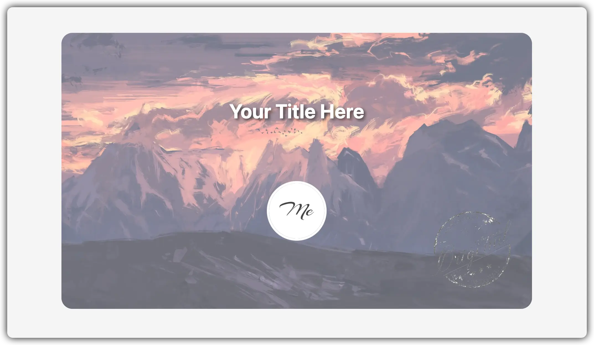
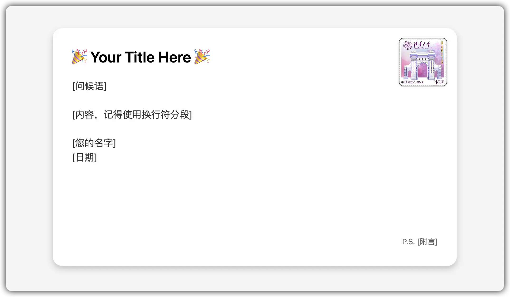

# Interactive Postcard

> A single-file, interactive electronic postcard (greeting card)

[简体中文](./README.md)

## Origin

This is a spur-of-the-moment creation. My friend [LiuShen](https://blog.liushen.fun), a fellow blogger in my blogroll, recently (August 9, 2024) changed to a new domain. In my eyes, personal blogs are like cyber homes (I like to call them islands), so changing domains is like moving house in cyberspace. As a friend, it's only right to send a little housewarming gift. Considering the blog framework hasn't changed, it's like the decoration and furniture are still there, ~~and given my lack of money and technical skills~~, after some thought, I decided to whip up a simple cyber postcard using basic front-end technology.

Then I realized that others might need something like this, so with Liu's permission, I've open-sourced it.

## Preview

Front:

Back:

Click the favicon to flip.

## Usage

1. Download the source code zip and extract it.
2. Replace the `message` content on line 204 of `index.html` with your own content (and other contents).
3. Replace the images in the `img` folder. Check the comments in `index.html` to see which image is which.
4. Package it up and send it to your friend. That's it. ~~You can delete the `README.md` and `others/` and pretend you wrote it yourself.~~

## Notes

- This project has no external dependencies. If you want to make it truly single-file, just change the images to image hosting links.
- This project is entirely based on native HTML, so it should work for years to come. Therefore, it probably won't be maintained very actively.
- If you have better designs, feel free to submit a PR.

## License

MIT License.
