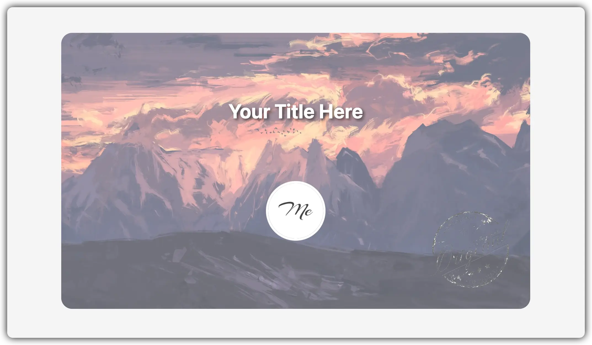
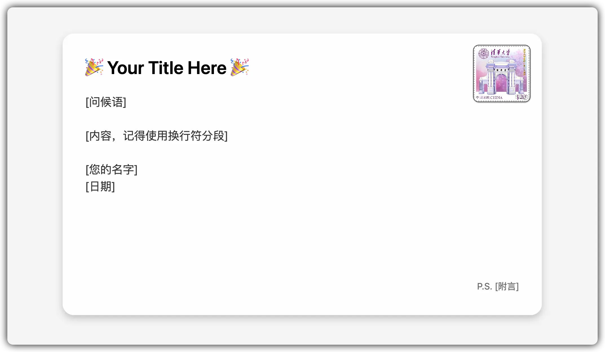

# Interactive Postcard

> 一个单文件、交互式的电子明信片（贺卡）

[English Version](./README.en.md)

## 起因

这是一个临时起意的产物。我的友链博主[清羽飞扬](https://blog.liushen.fun)老友最近（2024.8.9）换了个新的域名，在我眼里，独立博客就是赛博家园（我喜欢叫小岛），那么换域名就是赛博搬家了。那么作为朋友，送点 Housewarming 的小礼物是应该的。考虑到框架没换，相当于装修和家具都还在，~~再加上我没钱也没技术~~，思来想去就用简单的前端技术搓一个电子明信片吧。

然后我想到，可能会有其他人需要这种东西，于是在征得清扬老友同意后，我把它开源了。

## 预览

正面：

背面：

点击徽标翻面。

## 使用

1. 下载源代码压缩包并解压。
2. 替换 `index.html` 第 204 行的 `message` 相关内容为你自己的内容（以及其他内容）。
3. 替换 `img` 中的图片，具体哪个图片是什么请看 `index` 的注释。
4. 打包发给你的朋友，完事。~~你可以把 `README.md` 和 `others/` 删掉，假装是你自己写的。~~

## 注意事项

- 本项目没有任何外部依赖，如果你想做到极致的单文件，把图片变成图床链接就行。
- 本项目完全基于原生 HTML，估计十年以后还能打开，所以应该不会维护得很勤快。
- 如果您有更好的设计，欢迎提 PR。

## 许可证

MIT Licence.
